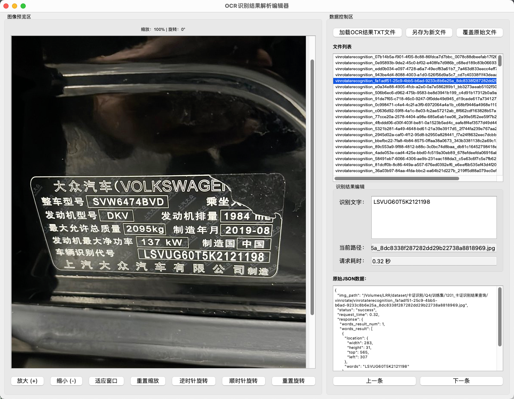
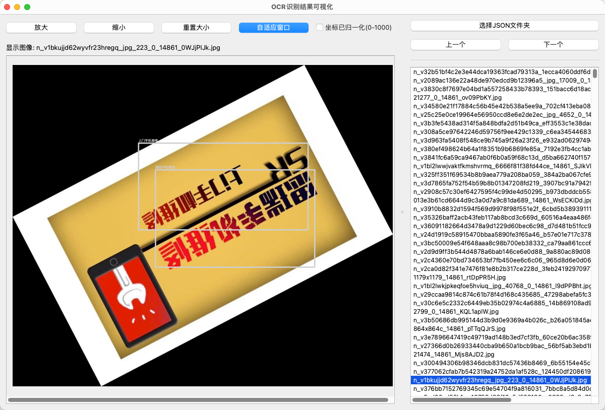
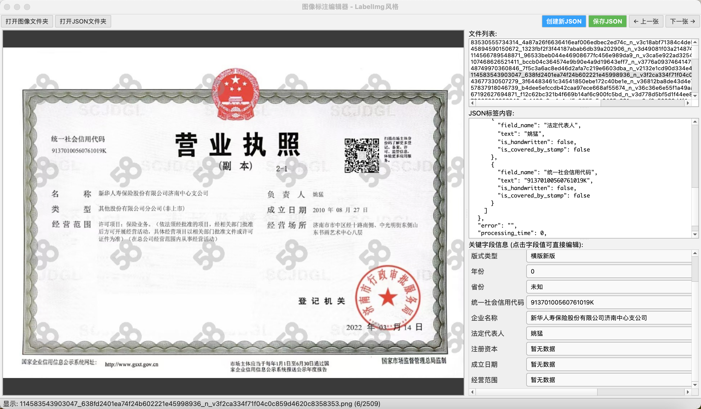
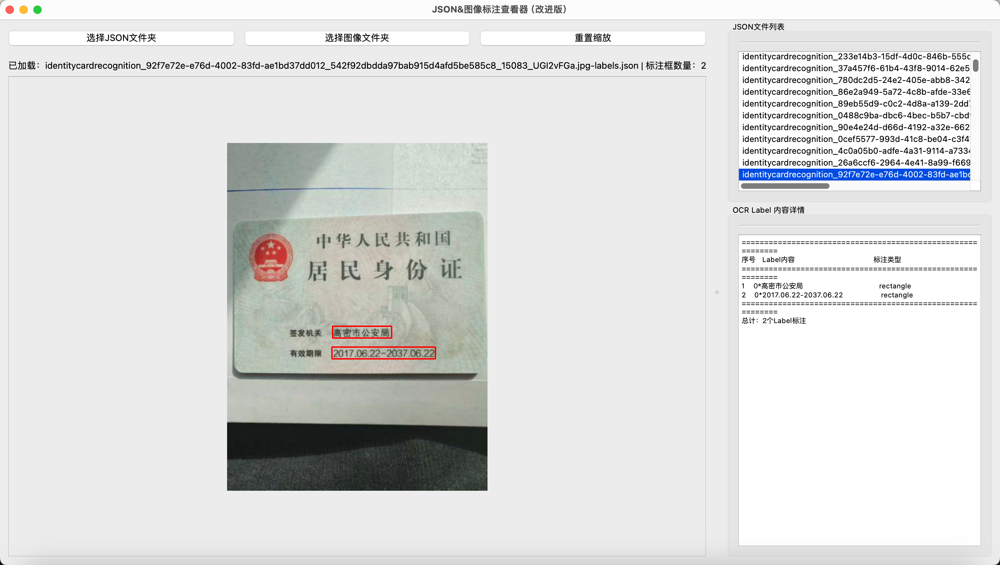
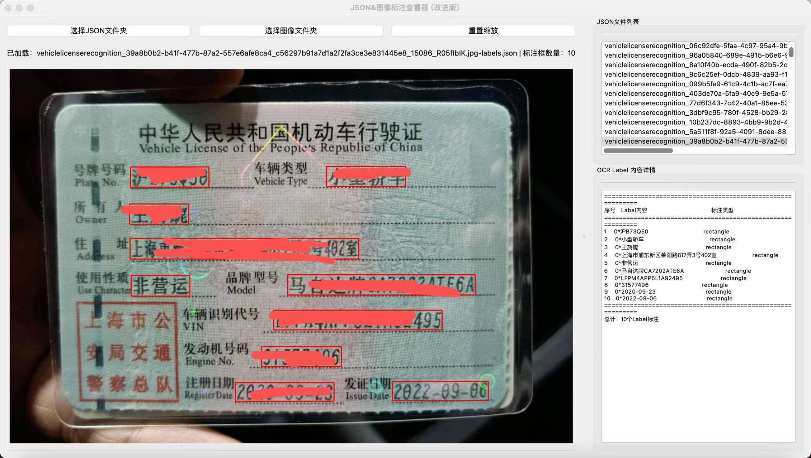
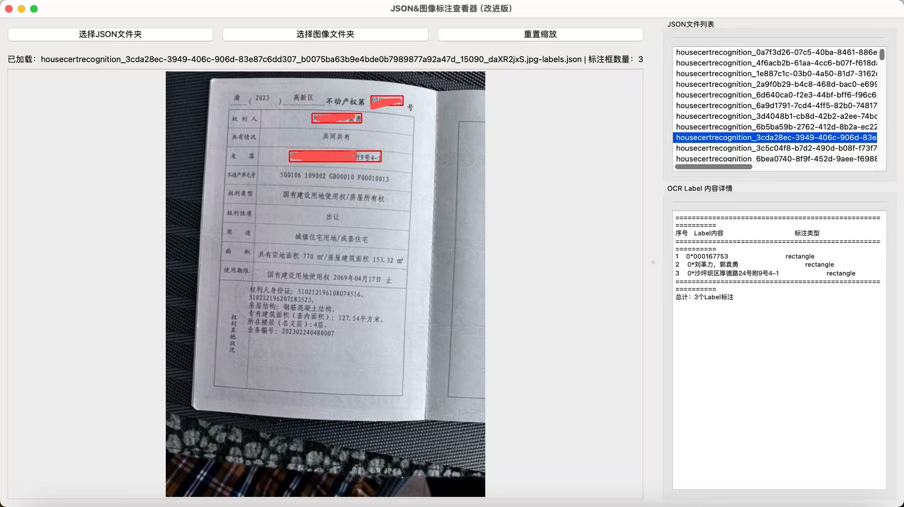
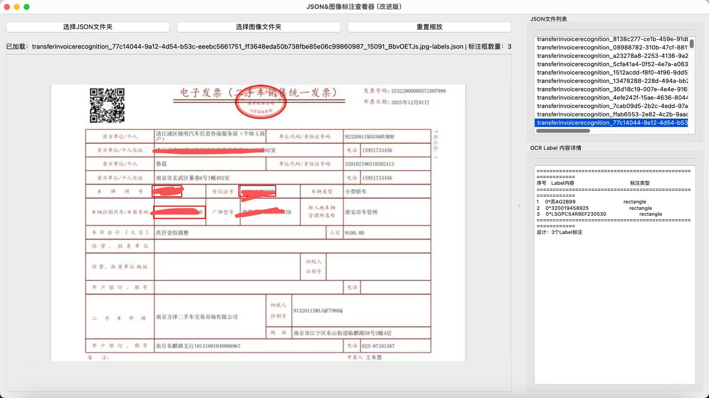
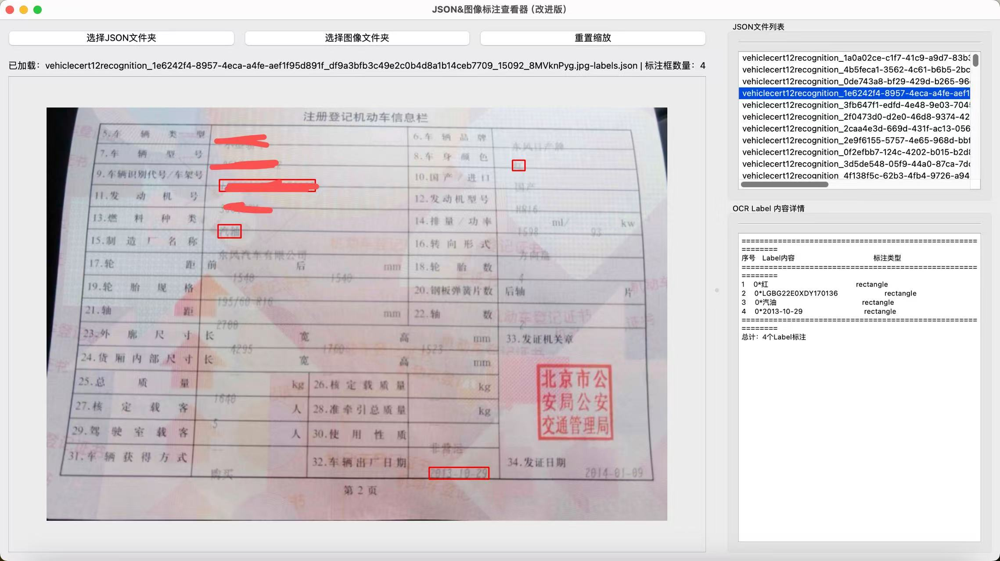
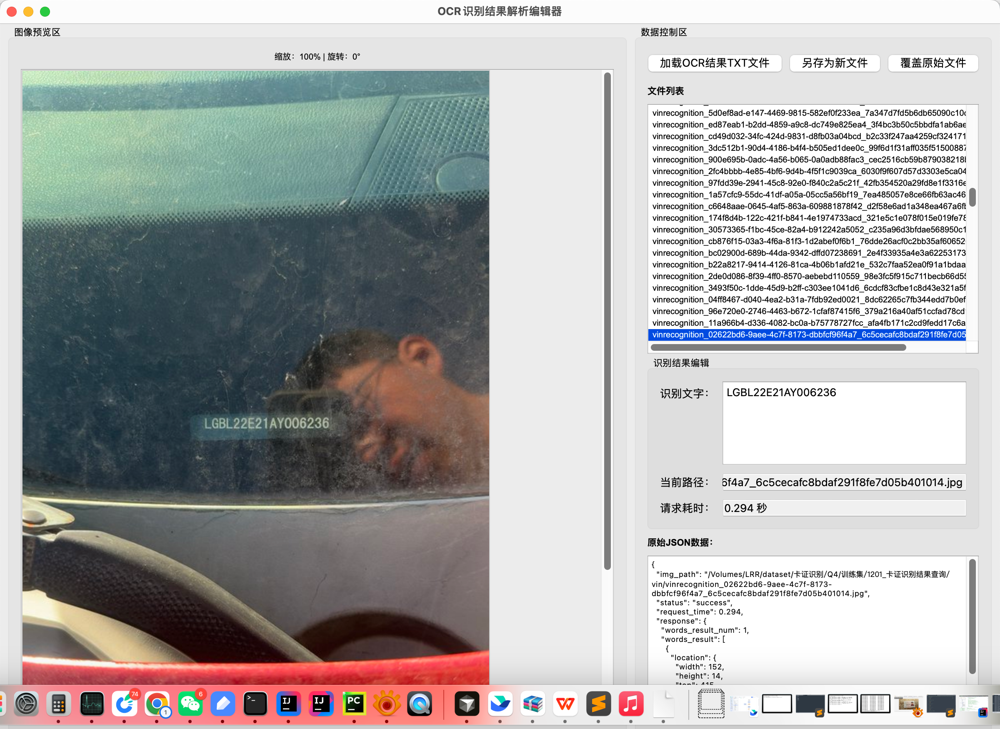

# OCR Label PyQt

一组用于卡证 OCR 测试集人工复核的本地桌面脚本：查看图片及识别结果、核对文本或框坐标，并编辑 JSON/JSONL 标注。脚本从实际标注流程中整理而来，按输入格式保留多个独立入口；目前并非统一的打包应用。

## 适用场景

在卡证 OCR 升级评测中，测试样本先经旋转矫正，再由人工核对 VIN、临时号牌、通用 OCR、身份证、行驶证、房产证、过户票、机动车登记证及营业执照等结果。工具主要解决三类问题：

1. 在图片旁展示结构化字段或 OCR 检测框，减少逐条打开 JSON 的时间。
2. 让标注人员直接修正识别文本和营业执照字段，并保存结果。
3. 对比不同模型的坐标系，将归一化坐标或缩放后坐标映射回原图核查。

仓库包含下方用于展示界面的截图，但**不包含**原始测试图片、标注结果、OCR 差异报告、模型权重或服务凭据。请仅使用有权处理的本地数据。

## 界面展示

以下是实际工具的界面截图，用于展示图像预览、OCR 文本复核、检测框和 JSON 字段编辑等工作流；仓库中的脚本是按输入格式分别运行的独立工具，并非一个统一的应用。

### 识别结果编辑与可视化

VIN 识别结果编辑：左侧查看图像，可缩放、旋转；右侧核对识别文本、耗时及原始 JSON，支持另存或覆盖。



通用 OCR 检测框可视化：对照图像中的文本框，并切换坐标归一化选项。



营业执照字段标注：并排显示证照、JSON 全文和关键字段，便于逐项复核与保存。



### 卡证标注结果查看

下列界面展示按 JSON 文件切换样本、叠加标注框和检查 Label 详情。截图仅用于说明界面，不随仓库分发对应的原始图片或标注文件。

| 身份证 | 行驶证 |
| --- | --- |
|  |  |

| 房产证 | 过户票 |
| --- | --- |
|  |  |

| 机动车登记证正面 | VIN 识别样例 |
| --- | --- |
|  |  |

## 脚本入口

| 文件 | 作用 | 输入 |
|---|---|---|
| `show_cards_labels_dict.py` | 逐条编辑字段字典，长文本与短文本分别展示 | 每行一个 JSON 的 TXT/JSONL，`response.word_result` 为字典 |
| `show_cards_labels_list.py` | 查看/编辑通用 OCR 或 VIN 结果，支持缩放、旋转、另存及覆盖原文件 | 每行一个 JSON，`response.words_result` 为列表；也兼容 `word_result` 字典 |
| `show_cards_labels_plate.py` | 临时号牌的号码字段编辑 | 每行一个 JSON，`response.words_result.number` |
| `show_cardsocr_mpai_qwen3.py` | 可视化 OCR 文本框，可切换 0–1000 归一化坐标到原图像素 | JSON 文件夹，`image_path` 与 `model_response[].bbox_2d/text_content` |
| `show_cardsocr_mpai_lingan.py` | 可视化按模型输入尺寸缩放的文本框，并映射回原图 | 同上；具体坐标变换以脚本实现为准 |
| `show_hengxing.py` | 展示矩形标注、标签和类型，切换图片时重置旧图像及标注 | JSON 文件夹，`result[].position/label/ptype`；另选图像文件夹 |
| `business_license/show_json.py` | 营业执照图片和 JSON 的只读查看器 | 分别选择图片与 JSON 文件夹 |
| `business_license/show_json_edit_v1.py` | 营业执照字段编辑的早期版本 | 图片与 JSON 文件夹 |
| `business_license/show_json_edit_v2.py` | 营业执照字段编辑的迭代版本 | 图片与 JSON 文件夹 |
| `business_license/show_json_edit_v3.py` | 营业执照字段编辑较新版本：关键字段、JSON 全文、缩放/旋转与快捷键 | 图片与 JSON 文件夹 |

`v1/v2/v3` 用于保留迭代过程，建议从 `v3` 了解完整营业执照标注流程。各脚本的数据结构并不完全相同，使用时选择与输入格式匹配的入口。

## 安装与运行

建议使用 Python 3.10+，并为 PyQt5 与 PyQt6 脚本分别准备虚拟环境，避免 Qt 插件冲突。示例：

```bash
python3 -m venv .venv
source .venv/bin/activate
pip install PyQt6 pillow opencv-python numpy
python show_cards_labels_list.py
```

运行营业执照脚本时，在单独环境中安装 `PyQt5 opencv-python numpy`，然后执行：

```bash
python business_license/show_json_edit_v3.py
```

脚本均通过桌面文件选择器加载本地输入，不会自动调用远程 OCR 服务。`mpai` 是原始脚本命名，不表示运行时需要平台账号。

## 最小数据格式

字段编辑器读取 UTF-8 文本文件，**每行一个 JSON 对象**。例如（路径和内容均为虚构）：

```json
{"img_path":"/path/to/sample.jpg","response":{"word_result":{"field":{"word":"示例"}}}}
```

可视化脚本读取 JSON 文件夹中的单文件结果，例如：

```json
{
  "image_path": "sample.jpg",
  "model_response": [
    {"bbox_2d": [100, 120, 500, 200], "text_content": "示例文字"}
  ]
}
```

坐标可能是原图像素，也可能是 0–1000 归一化坐标或模型缩放图上的坐标。切换坐标选项前，应核对模型输出约定；不要仅凭框看起来“接近”就认为变换正确。

## 使用注意

- 标注脚本可保存或**覆盖**原 JSONL/JSON 文件。正式数据请先备份，并优先使用“另存为”。
- `business_license/show_json_edit_v3.py` 的 `Delete` 操作会在确认后直接删除当前图片及对应 JSON，**不经过回收站**。
- 部分脚本通过 `image_path` 或文件名前缀寻找图片；跨机器使用时需修正 JSON 中的路径。
- 仓库只附带静态界面截图，未附带可直接运行的业务样本；GUI 效果需在本地使用有权处理的样本验证。
- `show_cardsocr_mpai_lingan.py` 中的模型尺寸映射是特定场景的近似实现，不能作为所有 VLM 的通用坐标变换公式。

## 校验范围

发布前对所有 Python 文件进行了语法解析；由于当前执行环境未安装 PyQt/OpenCV，未进行 GUI 交互测试。发布副本修复了 `business_license/show_json_edit_v3.py` 中两处孤立字符导致的缩进错误，原始工作目录未改动。
